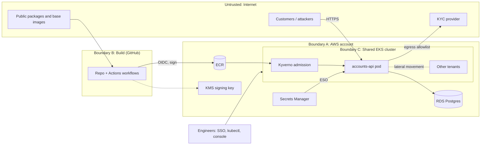

# Threat Model: accounts-api

Scope: `accounts-api` on a shared multi-tenant EKS cluster, built by GitHub Actions, images in ECR, Postgres on RDS, secrets in AWS Secrets Manager, one outbound dependency (third-party KYC provider). Holds PII and card data.

## Trust boundaries

## Top 5 threats (ranked by likelihood of materialising here)

| # | Threat | Attacker entry point | What they reach | Control in this submission, or accepted risk |
|---|---|---|---|---|
| 1 | **Software supply-chain poisoning** | Malicious or vulnerable dependency, base image, or tampered image | Code execution in the pod: its IAM role, DB credential, customer data | Trivy SCA gate, digest-pinned bases in manifests, SBOM attestation, KMS-signed images, Kyverno `verifyImages`, immutable ECR tags (Sections 2, 3, 5) |
| 2 | **Pipeline and DevSecOps infrastructure compromise** (includes maintainer GitHub account takeover) | Phished maintainer, stolen token, modified workflow file or third-party Action | Build secrets, signing path, push-to-prod | OIDC with `sub` scoped to one repo and main branch, KMS `Sign` limited to the pipeline role, CODEOWNERS on workflows, expiring waivers and break-glass audit trail (action SHA pinning is a stated Monday task: tags used here), manual approval on prod not built (Sections 2, 3). **Accepted:** an org admin can still weaken branch protection; needs repo settings and audit alerting |
| 3 | **Over-privileged identity and service-to-service lateral movement** (includes RCE in `accounts-api`) | RCE or stolen service account token | Secrets Manager and KMS via wildcard IAM, cluster secrets via RBAC `*`, host via Docker socket and hostPath mounts, other tenants | Section 4 fixes (IAM, RBAC, hardened pod), Kyverno baseline, default-deny NetworkPolicy, Falco rule (Sections 4, 5) |
| 4 | **Insider threat and blind orchestration access** | Legitimate engineer access (SSO, `kubectl`, console) used for misuse | Secrets, DB, PII | Secrets never in repo or manifests (ESO), least-privilege RBAC, CloudTrail fixed (multi-region, log validation). **Accepted:** no just-in-time access or session recording in this submission |
| 5 | **Denial of service (DDoS flood)** | Internet-facing API | Availability only, no data loss | Kyverno requires CPU and memory requests and limits (protects neighbours on the shared node). **Accepted:** volumetric protection (WAF, Shield, edge rate limiting) sits upstream of this repo; named as roadmap |

## Overrated threat: zero-day network perimeter penetration

Attackers rarely spend a costly zero-day on brute-force entry when stolen credentials, loose IAM and phishing of privileged staff are cheaper. This submission spends effort on threats 1 to 4 (identity, pipeline, supply chain) and deliberately builds no dedicated perimeter-exploit control. Compensating cover: patch cadence via SCA and admission policy.

## Traceability

Every control in Sections 2 to 6 carries a tag `[T1]` to `[T5]` in its file header. Any control without a tag is explained there.
